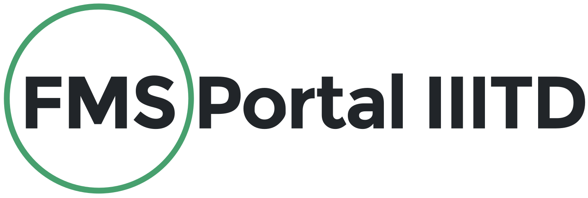

# FMS Portal IIITD

[](https://github.com/fms-portal-iiitd)

FMS Portal IIITD is complaint management system developed for IIITD internal usage with integration to OSA IIITD Main App. Below are some of its main features:

- Admin, User Login System and Dashboard
- Complaint Management and Tracking
- Media Upload Feature
- Complaint Feedback System
- Analytics for Admin and Export Data

## Technologies

FMS Portal IIITD is powered by a number of technologies:

- [Django] - high-level Python Web framework
- [PostgreSQL] - a powerful, open source object-relational database system
- [Twitter Bootstrap] - great UI boilerplate for modern web apps
- [Font Awesome] - internet's most popular icon toolkit
- [jQuery] - new Wave JavaScript

And some simple libraries like [Chart.js](https://www.chartjs.org/) etc.

## Setup

1. To clone and run, you'll need Git, [Python] v3.0+ and [PostgreSQL] v9+ installed on your computer. From your command line:

```bash
# Clone this repository
$ git clone https://github.com/avisionx/fms-portal-iiitd.git

# Go into the repository
$ cd fms-portal-iiitd

# Install dependencies in a virtualenv
$ pip install -r requirements.txt
```

2. For environment variables check out .env.examples in fms folder and create .env file for your own variables

```bash
# Create .env file
$ vim ./fms/.env
```

The databse variables are from [PostgreSQL] database setup.

If you are using gmail smtp server provide email and password in the environment variables.

3. You are good to go just start the server after making migrations.

```bash
# Make migrations
$ python manage.py makemigrations

# Migrate the changes
$ python manage.py migrate

# Start the server
$ python manage.py runserver
```

Server by default starts in development mode at http://127.0.0.1:8000/

## Development

Great setting it all up! Let's contribute now. You'll need to learn Django basics to work on the app.

1. Make sure to start from the master branch and update your local repositories.

```bash
# Start from master
$ git checkout master

# Stay updated
$ git pull
```

2. Create a new branch for each bug fix or issue. Rest is basic.

```bash
# Create new branch keep qoutes
$ git checkout -b "YOUR_NEW_BRANCH"
```

## Deployment

Once the code is on the server we can nginx with gunicorn to host the app. Refer [here](https://www.digitalocean.com/community/tutorials/how-to-set-up-django-with-postgres-nginx-and-gunicorn-on-ubuntu-18-04) for more information.

## License

MIT

---

[django]: https://docs.djangoproject.com/
[postgresql]: https://www.postgresql.org/
[twitter bootstrap]: https://getbootstrap.com/
[jquery]: http://jquery.com
[font awesome]: https://github.com/FortAwesome/Font-Awesome
[python]: https://www.python.org/download/releases/3.0/
[django compressor]: https://django-compressor.readthedocs.io/en/stable/
